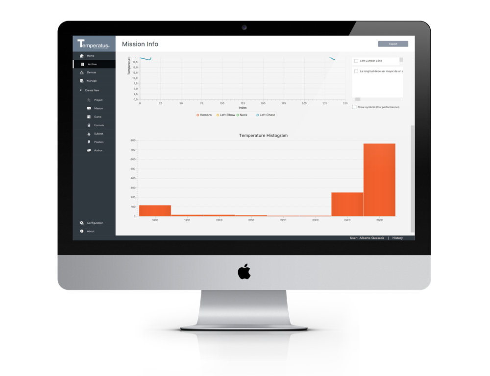

# Temperatus - Temperature Data Logging

Temperatus is a premier data analysis software platform. Trusted by researchers around the world, Temperatus is used to configure iButtons for deployment and to download, process, and securely manage collected temperature data.

