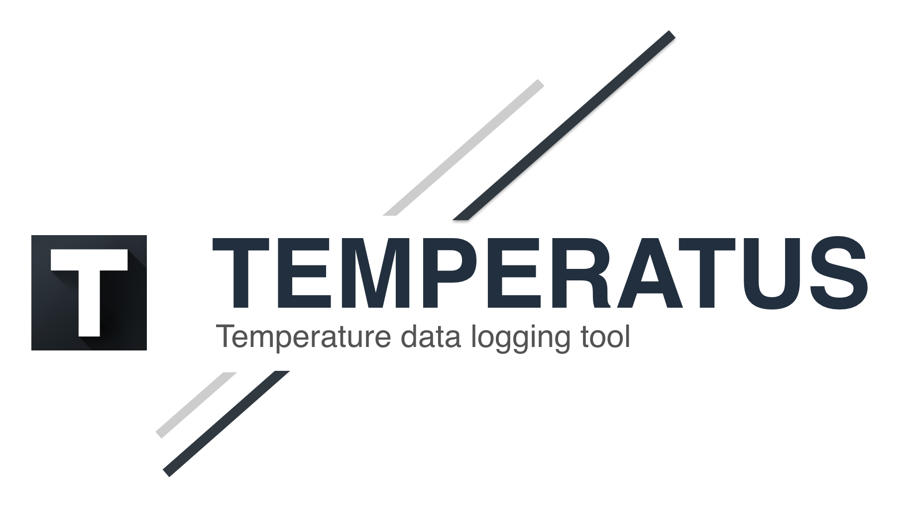

Temperatus is a premier data analysis software platform. Trusted by researchers around the world, Temperatus is used to configure iButtons for deployment and to download, process, and securely manage collected temperature data.

## Features
- Direct interaction with the supported iButton devices.
- Explore your data with beautiful charts that help you visualize the results.
- Export your data with the format you need to continue your experiments.
